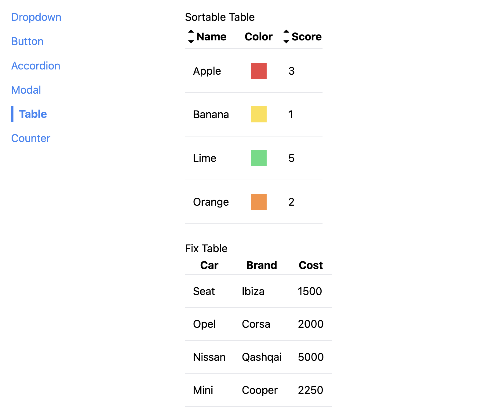

# React_FWK_Docu

Repository created following this [Udemy Course](https://www.udemy.com/course/react-redux/) to practice the following basic React concepts:

- Navigation
- Advanced components props system
- Intensive Component Reutilization

## Application

Application is basically intending to emulate a Framework documentation where, by using navigation you can check different components and it behaviour.


## Run Locally

Clone the project

```bash
  git clone https://github.com/pedrolopezbiedma/React_FWK_Docu.git
```

Install dependencies

```bash
  npm install
```

Start the application

```bash
  npm run start
```

## Authors

- [@pedrolopezbiedma](https://github.com/pedrolopezbiedma)
